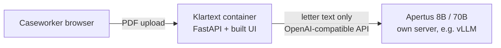

# Klartext

**Batch triage of official Swiss letters for caseworkers, built on Apertus.**

Hack Apertus 2026 · Track 2B (Own Project) · Team: Yusuf Öztoprak, Alexis Merle

| Deliverable | Link |
|---|---|
| Technical report | [technical_report.md](technical_report.md) (PDF: `TeamName_Report.pdf`) |
| Demo video (max. 2 min) | TODO |
| Dataset on Hugging Face | TODO |

A caseworker (social services, a municipality, a legal aid office) receives a pile of
official letters: tax offices, health insurers, debt collection. Klartext reads them
with Apertus, **sorts them by urgency**, and shows for each letter the sender, the
deadline, what the recipient has to do and what happens otherwise.

**The model is never trusted blindly.** Every fact comes with a verbatim quote from the
letter, and the quote is checked in code. Anything that cannot be found in the letter is
marked as unverified. The client can then get an explanation in one of 10 languages,
written from the verified facts only.

## Quick start

Requirements: Docker with Compose, and access to an OpenAI-compatible endpoint serving Apertus.

```bash
cp .env.example .env      # then put your key into LLM_API_KEY
make run                  # = docker compose up --build
```

- App: http://localhost:8000 (drag in PDF letters, they appear sorted by urgency)
- API docs: http://localhost:8000/docs
- Stop: `make stop`

Sample letters are in [`data/`](data/) (all synthetic). Without a valid `LLM_API_KEY` the app starts,
but analysing a letter fails.

| Variable | Meaning | Default |
|---|---|---|
| `LLM_BASE_URL` | OpenAI-compatible endpoint serving Apertus | `https://hackapertus.livemap.sh/v1` |
| `LLM_API_KEY` | API key for that endpoint (never committed) | none |
| `LLM_NAME` | small model, tried first | `apertus-v1.5-8b` |
| `LLM_NAME_LARGE` | large model: escalation and explanations | `apertus-v1.5-70b` |

## How it works

1. **Read.** pdfplumber extracts the text. Hyphenated line breaks are joined and repeated
   headers/footers are removed. Scanned PDFs without a text layer are rejected (no OCR).
2. **Extract.** Apertus returns sender, deadline, actions and consequences. For each point it
   gives an English `value` and a `source_span` copied word for word from the letter.
3. **Verify, in code.** The span is normalised (Unicode, quotes, whitespace, case) and must occur
   in the letter. A date must appear inside its own quote. A period ("within 30 days") must contain
   that number. A deadline claiming both a date and a period is flagged. The model never sets the
   `verified` flag.
4. **Cascade.** The 8B model answers first. If any point is unverified or the output is invalid,
   the 70B model answers instead (`escalated: true`). Most letters stay on the cheap model.
5. **Triage.** Letters are sorted by days left, letters without a deadline last. A relative deadline
   is counted from the letter date and shown as an estimate (`~20 days`).
6. **Explain.** On request, the 70B model explains the letter in the chosen language using verified facts only.

Verification is deliberately strict: a false alarm costs a caseworker a quick look, a wrong but
"verified" answer costs far more.

## Target architecture: on-premise or air-gapped



- **One container, one external dependency.** The UI is built at image build time and served by the
  same FastAPI process. At runtime the only thing it talks to is the Apertus endpoint.
- **Air-gapped:** point `LLM_BASE_URL` at an Apertus server inside the same network. Nothing else leaves the machine.
  No telemetry and no third-party calls at runtime.
- **Build time vs runtime:** pip and npm need internet at build time; the running container does not.
- **Privacy:** letters and results are kept in memory only. No database, nothing is written to disk, everything
  is gone when the container stops. All sample data is synthetic.
- The hackathon endpoint is only used for development. The same setup works on-premise or on a Swiss cloud.

## API

| Method | Path | Purpose |
|---|---|---|
| POST | `/documents` | upload one PDF |
| POST | `/documents/batch` | upload many PDFs, returns `{uploaded, failed}` |
| POST | `/documents/{id}/extract` | analyse a letter (cascade; `?model=` forces one model) |
| GET | `/letters` | analysed letters sorted by urgency |
| POST | `/documents/{id}/explain?language=de` | explanation from verified facts |
| GET | `/health` | liveness |

An example response is in [`docs/api_example.json`](docs/api_example.json).

## Evaluation (development set)

Ten synthetic letters (DE/FR/IT: tax, health insurance, debt collection) with hand-written
ground truth in [`data/ground_truth/`](data/ground_truth/). Five setups: A 8B raw, B 70B raw,
C 8B + check, D 70B + check, E cascade. Raw model answers and scores are saved in
[`data/runs/`](data/runs/), so every number can be recomputed without calling the API.

| Setup | Undetected errors | Note |
|---|---|---|
| A: 8B raw | 1 / 42 | |
| B: 70B raw | 3 / 41 | |
| C: 8B + check | 0 / 39 | |
| D: 70B + check | 0 / 34 | |
| E: cascade | 0 / 35 | about 3.3 s per letter vs 6.0 s for 70B; 3 of 10 letters escalated |

"Undetected error" means a wrong answer that is shown as verified. The check turns these into
flagged answers a human looks at; the cascade then fixes most flagged answers at lower cost than always using 70B.

**Caveat:** these ten letters were also our development set, and some checks were added after
we saw failures on them. The numbers show a direction, not a guarantee. A blind set is scored once at the end.

<!-- TODO: add blind-set results here and in the report -->

```bash
cd src
pip install -r requirements.txt -r requirements-dev.txt
python -m pytest                       # unit tests
python scripts/run_benchmark.py        # needs .env, calls the API
python scripts/score_benchmark.py      # scores the latest saved run, offline
```

## Limitations

- No OCR: scanned letters are rejected with a clear error.
- One deadline per letter.
- Multi-column layouts can reorder words; such quotes are flagged as unverified instead of trusted.
- State is in memory in a single process: restart means upload again.
- Tested on synthetic letters only, in German, French and Italian.

## Repository layout

```
Makefile, docker-compose.yml, .env.example
data/
  *.pdf            synthetic letters (DE/FR/IT)
  ground_truth/    hand-written expected answers per letter
  runs/            raw model answers and scores of each benchmark run
docs/
  api_example.json example API response
  mock/            mock responses used for UI development
src/
  Dockerfile
  klartext/        api/ adapters/ domain/ services/ eval/ frontend/
  tests/
```

## Licence

Apache License 2.0, see the repository's `LICENSE`.

---

Hack Apertus: https://hackapertus.ch · Submission rules and judging criteria: see the event page.
